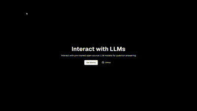

# OpenLLMs 💬🤖
A chat application that allows users to interact with pre-trained open-source LLM models for question answering. The application features a chat interface where users can input questions, and the application responds with answers generated by the selected models. The aim of this project is to demonstrate how to integrate pre-trained transformer models with a modern web frontend using Next.js and work with multiple LLMs simultaneously.



## Table of Contents

- [Tech Stack](#tech-stack)
- [Installation](#installation)
- [Running the Application](#running-the-application)
- [Usage](#usage)

## Tech Stack

- **Frontend**: Next.js 14, React, TypeScript, Tailwind CSS
- **Backend**: FastAPI, Python, SearxNG
- **Machine Learning**: Hugging Face Transformers for LLMs
- **Other Libraries**: Axios (for HTTP requests), CORS Middleware

## Installation

Follow these steps to set up and run the application on your local machine.

### Prerequisites

- Node.js 14+
- Python 3.7+
- Git
- Docker

### Steps

1. **Clone the Repository**

    ```bash
    git clone https://github.com/praneethravuri/open-llms.git
    ```

2. **Backend Setup**

    Navigate to the backend directory, create a virtual environment, and install the required dependencies.

    ```bash
    cd backend
    python -m venv venv
    source venv/bin/activate  # On Windows use `venv\Scripts\activate`
    pip install -r requirements.txt
    ```

    If the `requirements.txt` file does not exist, create it with the following content:

    ```txt
    fastapi
    uvicorn
    transformers
    torch
    tensorflow
    sentence_transformers
    nltk
    tf-keras
    language_tool_python
    textblob
    pymongo
    ```

    Additionally, install PyTorch with CUDA support:
    ```bash
    pip install torch torchvision torchaudio --index-url https://download.pytorch.org/whl/cu118
    ```

3. **Frontend Setup**

    Navigate to the frontend directory and install the required dependencies.

    ```bash
    cd frontend
    npm install
    ```

## Running the Application 🚀

### Backend

1. **Start the FastAPI Server**

    ```bash
    uvicorn app.main:app --reload --host 0.0.0.0 --port 8000
    ```

2. **Start SearXNG***

    Navigate to the searxng-docker directory and start SearxNG using Docker.

    ```bash
    cd searxng-docker
    docker-compose up
    ```


### Frontend

1. **Start the Next.js Development Server**

    ```bash
    npm run dev
    ```

### Access the Application

Open your browser and navigate to `http://localhost:3000` to see the chat interface.

## Usage

1. **Interact with the Chat Interface**

    - Open the chat interface in your browser.
    - Type a question in the input box at the bottom.
    - Press the send button or hit enter to send your question.
    - The application will respond with an answer generated by the selected model.

2. **Interact with Different LLMs**

    - Select a particular pre-trained LLM.
    - Type a question in the input box at the bottom.
    - Press the send button or hit enter to send your question.
    - The application will respond with an answer generated by the selected model.

By following these steps, you will be able to interact with various pre-trained language models through a modern and intuitive web interface. Enjoy exploring the capabilities of LLMs! 🎉🧠